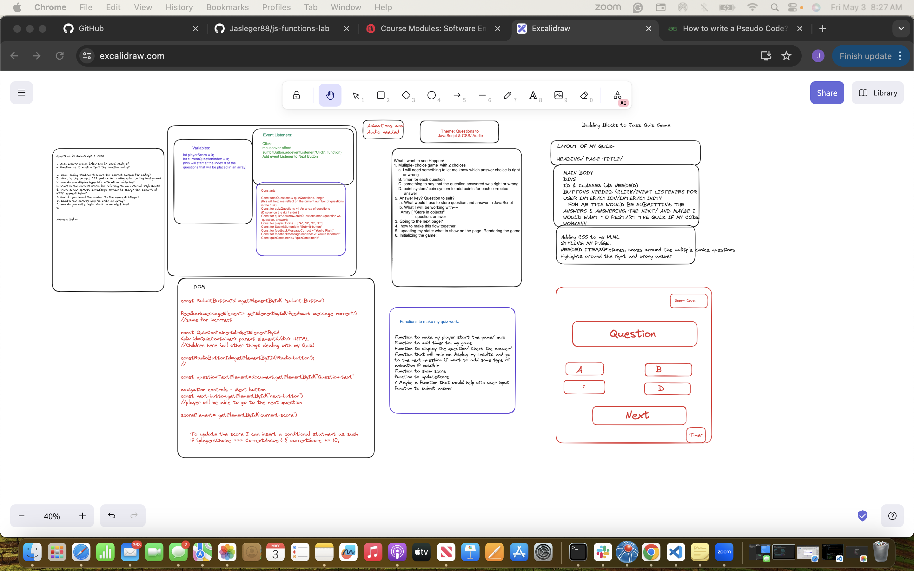

## Game Details

Code-Dash is a JavaScript and CSS quiz game designed to challenge and educate novice coders on the fundamentals of programming. The interactive nature of the game encourages rapid and confident responses, fostering a hands-on learning experience. 

Drawing from my background as an educator, I developed this game to inject fun into the learning process and engage learners through interactive questioning.

## Link to Code-Dash Quiz

 https://jasleger88.github.io/Code-Dash-Quiz-JavaScript-CSS/

 ## Target Audience 

* This game is tailored for beginner coders, like myself, who are seeking an engaging platform to learn CSS and Javascript interactively. It's designed for those at the novice level of coding, offering a smooth and swift selection process for players/learners.


## Technology included:
* HTML, JavaScript, React.js for building the interactive quiz interface
*Additonal Tools: Node.js and npm for package management, Git for verson control. 


## Features

* Interactive Quiz: Players can engage with multiple-choice questions concerning JavaScript and CSS topics.

* Question Bank: The game utilizes a question bank to store a variety of questions on different topics, ensuring diversity and challenge for players.

* Scoring System: A scoring system is integrated to track players' performance based on the number of correct answers they provide.

* Feedback Messages: After each question, players receive a feedback message informing them whether their answer was correct or incorrect.

* Audio Effects: Audio effects, including sound cues for correct and incorrect answers or background music, are incorporated to enhance the user experience.

* Win/Loss Condition: The game implements win and loss conditions based on players' performance, such as achieving a certain score threshold to win or losing after a certain number of incorrect answers.

* Responsive Design: The game interface is responsive and accessible across different devices and screen sizes.

* Accessibility Features: To cater to a wider audience, the game includes accessibility features like keyboard navigation support and screen reader compatibility. 

## Deployment

* Clone the Repository

* Navigate my Project to Directory

* Build the Project

*Run the project Locally

* The project is now running locally on  https://jasleger88.github.io/Code-Dash-Quiz-JavaScript-CSS/

* Deployment to Production- Deployed to GitHub repository


## Planning
 


## Starting the Game

```
function startGame() {
   currentQuestionIndex = 0;
   playerScore = 0;
   displayQuestion(quizQuestions[currentQuestionIndex].question,
      quizQuestions[currentQuestionIndex].option);

}
const nextButton = document.getElementById('next-button');

function displayQuestion() {
   const currentQuestion = quizQuestions[currentQuestionIndex]
   questionText.innerText = currentQuestion.question;
   currentQuestion.option.forEach((choice, index) => {
      answerChoices[index].textContent = choice;
   });

}
function nextQuestion() {
   currentQuestionIndex++;
   if (currentQuestionIndex < quizQuestions.length) {
      displayQuestion();
      answerChoices.forEach(choice => {
         choice.disabled = false;
      });
   }
}
```


## Winning/ Lossing Concept

- Win Condition: The player wins the game when they achieve a certain objective or meet specific criteria. If the player answers a certain number of questions correctly, they win; otherwise, they lose. Positive reinforcement is included as a sense of accomplishment for the player upon winning, such as the congratulatory message.

- Loss Condition: The player fails to win the game when they are unable to achieve the win condition or make too many mistakes. The loss condition occurs when the player answers too many questions incorrectly or fails to reach the target score.


## Challenges

* Challenge: Maintaining a balance between educational content and game mechanics to sustain player engagement.

* Solution: Employing iterative design and testing methods to discover the optimal equilibrium between learning objectives and gameplay dynamics.


## Future Enhancements

In the future, my ambition is to introduce numerous improvements and stretch objectives for the game. These aspirations encompass, among others, the integration of coins as a currency system to elevate the gaming experience, the introduction of a timer for each question to infuse a sense of urgency and interaction, thereby fostering a positive pressure that enhances the gameplay. Additionally, I aim to implement progress tracking, allowing players to monitor the number of remaining questions from those already completed.


